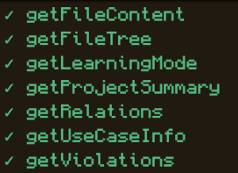
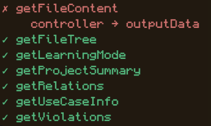

# Getting Started with Cave

## What is Cave?

Cave is a CLI (Command Line Interface) tool designed for CSC207 students to help structure, visualize, and verify clean architecture in their Java projects.

## Prerequisites

- [Node.js](https://nodejs.org/en/download/) version 20.0 or above
- A CSC207 Java project (or let Cave create one for you!)

## Commands

### `cave init`

Initializes your CSC207 project with a sample clean architecture directory structure.

```bash
cave init
```

The created structure should like like:

```
src/
├── main/
│   └── java/
│       ├── app/
│       ├── use_case/
│       ├── entity/
│       ├── interface_adapter/
│       ├── data_access/
│       └── view/
└── test/
    └── java/
```

Run this first in your project folder. Cave will scaffold the recommended folder layout so you can start developing! These folders will not immediately be tracked by git as they are empty. If you want to 

---

### `cave usecase <usecasename>`

Initializes the folders and Java file structure for a new use case.

```bash
cave usecase <usecasename>
```

Replace `<usecasename>` with the name of your use case. Cave will generate the appropriate directories and boilerplate Java files following clean architecture conventions similar to the structure shown below:

```
src/main/java/use_case/
└── <usecasename>/
    ├── <usecasename>InputBoundary.java
    ├── <usecasename>InputData.java
    ├── <usecasename>Interactor.java
    ├── <usecasename>OutputData.java
    └── <usecasename>OutputBoundary.java

src/main/java/interface_adapter/
└── <usecasename>/
    ├── <usecasename>Controller.java
    └── <usecasename>Presenter.java
```

---

### `cave start`

Starts the front end visualizer so you can explore the interactions in your codebase.

```bash
cave start
```

This will open your browser to `http://localhost:5173` to view your project's adherence to clean architecutre.

---

### `cave verify`

Verifies your project's adherence to clean architecture — no need to open the front end.

```bash
cave verify
```

Cave will analyze your project and report any violations of clean architecture principles directly in your terminal.

**Clean project output:**



**Project with a violation:**



## Quick Start

A quick run through of how you can get your project started:

```bash
cave init                  # Set up your project structure
cave usecase MyFirstUseCase  # Set up the file strucutre of your first use case
```

Once you have written a use case you can then run:

```bash
cave start
```

to open the frontend to visualize how the dependencies in your project interact with one another.

If you are a Windows user, at the moment, running:

```bash
cave verify
```

may result in the friendliest user experience.
